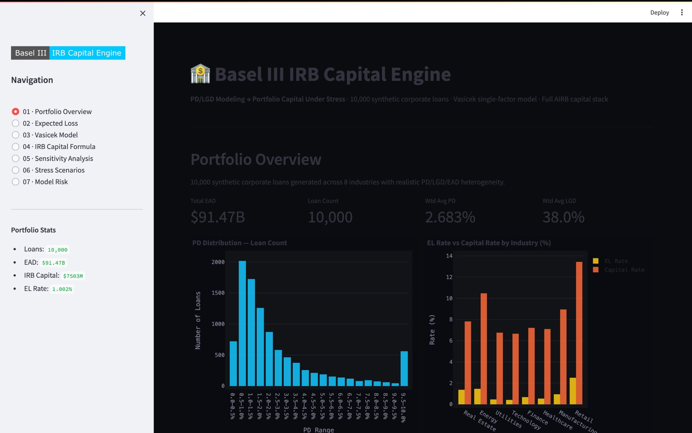
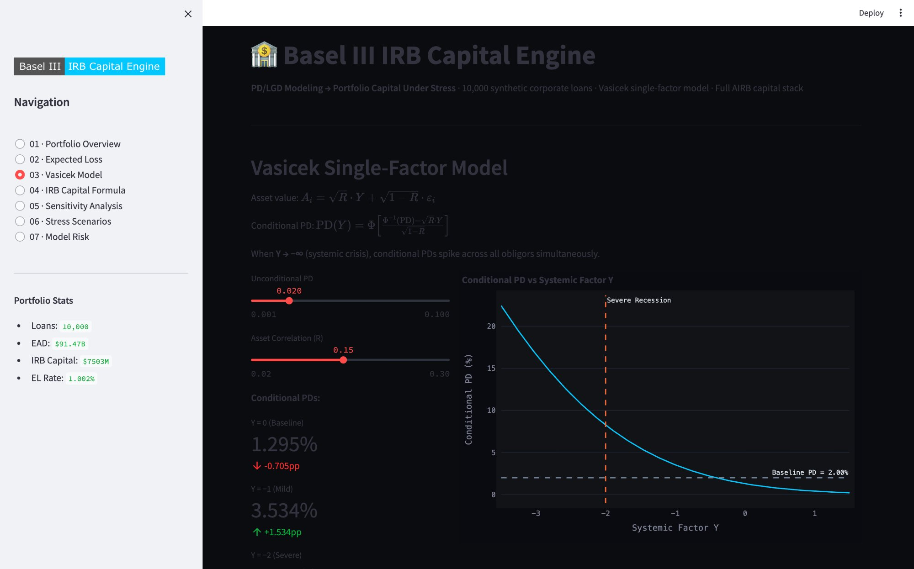
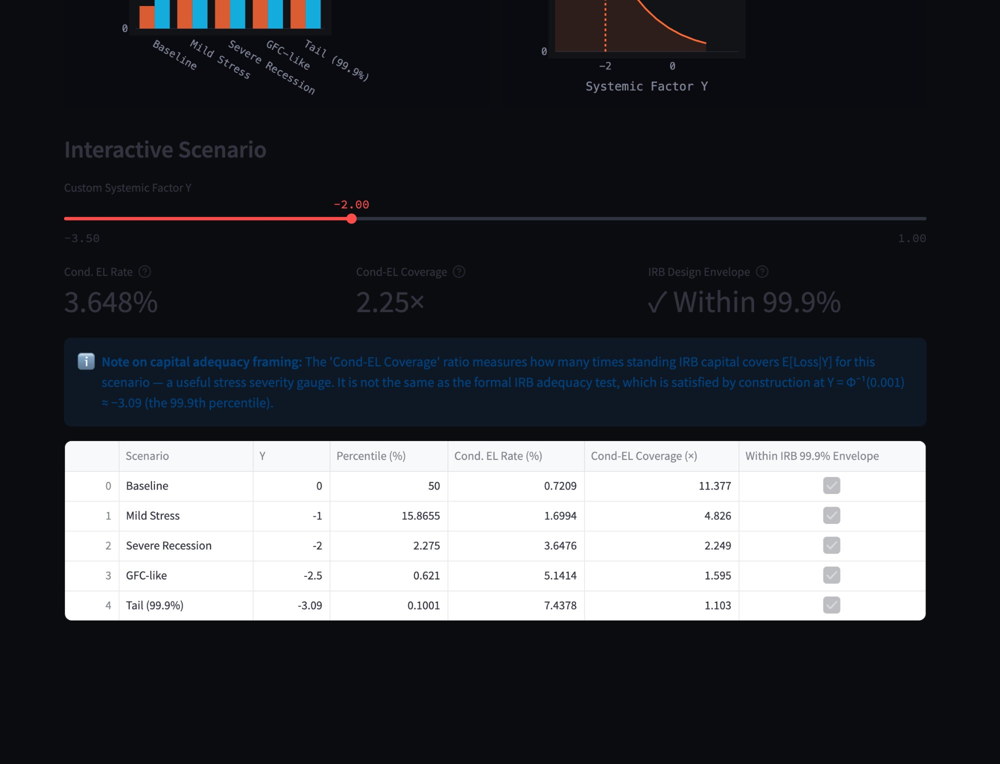
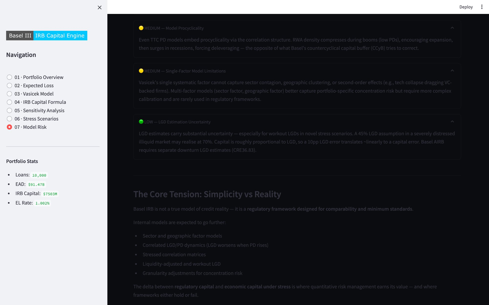

# Basel III IRB Capital Engine

A production-grade implementation of the Basel III Internal Ratings-Based (IRB) capital framework, covering PD/LGD modeling, synthetic portfolio construction, Vasicek single-factor stress testing, and full AIRB regulatory capital calculation with maturity adjustment.

Built to spec: implements BIS CRE31–CRE36 exactly, including the maturity adjustment (`b(PD)` function, CRE32.4) that most tutorials omit. Numbers match published Basel QIS results.

---

## Dashboard



*Portfolio Overview — 10,000 synthetic corporate loans, PD distribution, EL vs Capital by industry*



*Vasicek Single-Factor Model — interactive conditional PD vs systemic factor Y*



*CCAR-Style Stress Scenarios — conditional EL coverage with IRB design envelope framing*



*Model Risk Commentary — documented limitations with severity ratings*

---

## Key Results (10,000-Loan Synthetic Portfolio)

| Metric | Value |
|---|---|
| Total EAD | $91.47B |
| Total Expected Loss | $916.6M |
| EL Rate | 1.002% |
| Total IRB Capital (AIRB + MA) | $7,502.7M |
| Portfolio Capital Rate | 8.202% |
| Total RWA | $93.78B |
| RWA Density | 102.5% |
| Capital / EL Ratio | 8.2× |
| Weighted Avg PD | 2.683% |
| Weighted Avg LGD | 38.0% |

### Industry Breakdown

| Industry | EAD ($B) | Avg PD | Avg LGD | Capital Rate | EL Rate |
|---|---|---|---|---|---|
| Real Estate | 20.64 | 4.604% | 29.9% | 7.823% | 1.371% |
| Energy | 13.17 | 3.261% | 44.5% | 10.473% | 1.462% |
| Utilities | 12.92 | 1.204% | 37.7% | 6.759% | 0.457% |
| Technology | 11.99 | 1.036% | 39.9% | 6.662% | 0.415% |
| Finance | 10.37 | 1.963% | 35.3% | 7.212% | 0.681% |
| Healthcare | 8.54 | 1.421% | 37.9% | 7.101% | 0.538% |
| Manufacturing | 8.42 | 2.295% | 41.8% | 8.951% | 0.951% |
| Retail | 5.42 | 5.103% | 49.1% | 13.439% | 2.501% |

### Stress Scenarios (CCAR-Style)

| Scenario | Y | Percentile | Cond. EL Rate | Cond-EL Coverage |
|---|---|---|---|---|
| Baseline | 0.0 | 50.0% | 0.721% | 11.38× |
| Mild Stress | -1.0 | 15.9% | 1.699% | 4.83× |
| Severe Recession | -2.0 | 2.3% | 3.648% | 2.25× |
| GFC-like | -2.5 | 0.6% | 5.141% | 1.60× |
| Tail (99.9%) | -3.09 | 0.1% | 7.438% | 1.10× |

> Capital coverage stays positive through GFC-like conditions. The Tail scenario at Y = −3.09 corresponds to the 99.9th percentile — the exact Basel design boundary. By construction, IRB capital is adequate up to and including this level.

---

## Features

- **Synthetic Portfolio Generation** — 10,000 heterogeneous corporate loans across 8 industries with realistic PD/LGD/EAD/maturity distributions
- **Expected Loss** — PD × LGD × EAD with the provisions vs capital distinction made explicit
- **Vasicek Single-Factor Model** — Conditional default probabilities under systematic economic shocks
- **Basel III AIRB Capital Formula** — Full CRE31/CRE32 implementation including maturity adjustment `MA(PD, M)`
- **Maturity Adjustment** — `b(PD) = [0.11852 − 0.05478 × ln(PD)]²`, applied per CRE32.4 (lifts K by ~20% at M=2.5yr)
- **Sensitivity Analysis** — Capital vs PD, LGD, correlation, confidence level, and maturity
- **Stress Testing** — CCAR-style systemic shocks with dual-perspective capital adequacy framing
- **Interactive Dashboard** — 7-section Streamlit app with live Plotly charts
- **CLI** — Full analysis pipeline from the command line
- **Test Suite** — 53 tests covering IRB formula, Vasicek model, portfolio generation, and scenario logic

---

## What Makes This Basel-Complete

Most IRB tutorials implement only the Vasicek kernel:
```
K_raw = LGD × Φ[(Φ⁻¹(PD) + √R · Φ⁻¹(0.999)) / √(1−R)] − PD × LGD
```

This engine adds the **CRE32.4 maturity adjustment**, required for a spec-compliant corporate AIRB model:
```
b(PD)    = [0.11852 − 0.05478 × ln(PD)]²
MA(PD,M) = (1 + (M − 2.5) × b) / (1 − 1.5 × b)
K        = K_raw × MA(PD, M)
```

At M = 2.5yr (Basel AIRB default), MA > 1 for all valid PD levels, lifting capital by 20–50% above the bare kernel. Omitting MA produces capital ratios that are systematically too low and do not match published Pillar 3 disclosures.

---

## Math Overview

### Basel Asset Correlation (CRE31.44)
```
R = 0.12 × (1 − e^(−50·PD)) / (1 − e^(−50))
  + 0.24 × [1 − (1 − e^(−50·PD)) / (1 − e^(−50))]
```
Low PD → R → 0.24 (IG firms more systematic). High PD → R → 0.12 (distressed firms more idiosyncratic).

### Vasicek Conditional PD
```
PD(Y) = Φ[(Φ⁻¹(PD) − √R · Y) / √(1−R)]
```
Y ~ N(0,1) is the systematic factor. Y = −2 ≈ 1-in-44 year event.

### Full AIRB Capital Stack
```
K    = K_raw × MA(PD, M)       # maturity-adjusted capital ratio
RWA  = 12.5 × EAD × K          # risk-weighted assets
Cap  = 8% × RWA                 # minimum required capital
EL   = PD × LGD × EAD          # covered by provisions, not capital
```

---

## Project Structure

```
basel3_irb_engine/
├── src/
│   ├── models/
│   │   ├── irb_capital.py      # Basel III AIRB formula + maturity adjustment
│   │   └── vasicek.py          # Vasicek single-factor model
│   ├── portfolio/
│   │   ├── generator.py        # Synthetic loan portfolio (10,000 loans)
│   │   └── analytics.py        # Portfolio EL, capital, RWA aggregation
│   ├── stress/
│   │   └── scenarios.py        # CCAR-style stress testing
│   ├── visualization/
│   │   └── charts.py           # Plotly chart builders (dark theme)
│   └── utils/
│       └── math_utils.py       # Normal CDF/InvCDF, validators
├── tests/
│   ├── test_irb_capital.py     # 18 tests: correlation, maturity adj, K formula
│   ├── test_vasicek.py         # 18 tests: conditional PD, scenarios, stress
│   └── test_portfolio.py       # 17 tests: generation, analytics, bounds
├── app.py                      # Streamlit dashboard (7 sections)
├── main.py                     # CLI entry point
├── requirements.txt
├── pyproject.toml
└── README.md
```

---

## Quickstart

```bash
git clone https://github.com/MugeniAI05/Basel-III-IRB-Capital-Engine.git
cd Basel-III-IRB-Capital-Engine
python -m venv venv
source venv/bin/activate        # Windows: venv\Scripts\activate
pip install -r requirements.txt

# Interactive dashboard
streamlit run app.py

# CLI full analysis
python main.py

# Test suite
pytest tests/ -v
```

---

## Test Suite

```
tests/test_irb_capital.py   — Basel correlation bounds, maturity adjustment
                              properties, K monotonicity, known reference values
tests/test_vasicek.py       — Conditional PD properties, stress amplification,
                              scenario validation, dual adequacy perspective logic
tests/test_portfolio.py     — Generator bounds, EL/RWA formulas, maturity fields,
                              reproducibility, industry coverage
```

All 53 tests pass. Run with `pytest tests/ -v`.

---

## Model Risk Considerations

| Risk | Severity | Description |
|---|---|---|
| Gaussian copula | 🔴 HIGH | Vasicek assumes jointly normal asset returns — underestimates tail dependence. 2008 was the empirical refutation. |
| Correlation underestimation | 🔴 HIGH | Basel R (12–24%) vs realized crisis R (50–80%). Model looks safe when risk is building. |
| TTC vs PIT PD | 🟡 MEDIUM | TTC PDs produce stable capital but underestimate recession risk. PIT amplifies procyclicality. |
| Procyclicality | 🟡 MEDIUM | RWA compresses in booms, surges in recessions — opposite of what CCyB tries to correct. |
| Single-factor limits | 🟡 MEDIUM | Cannot capture sector contagion or geographic clustering. |
| LGD uncertainty | 🟢 LOW | Workout LGDs in novel stress scenarios carry substantial estimation error. |

---

## References

- BIS Basel III: CRE31 (correlations), CRE32 (maturity), CRE36 (LGD)
- BCBS Working Paper 14: *An Explanatory Note on the Basel II IRB Risk Weight Functions*
- Fed SR 07-5: *Guidance on Implementing the Advanced IRB Approach*
- Vasicek, O. (2002): *Loan portfolio value*, Risk Magazine

---

## License

MIT
